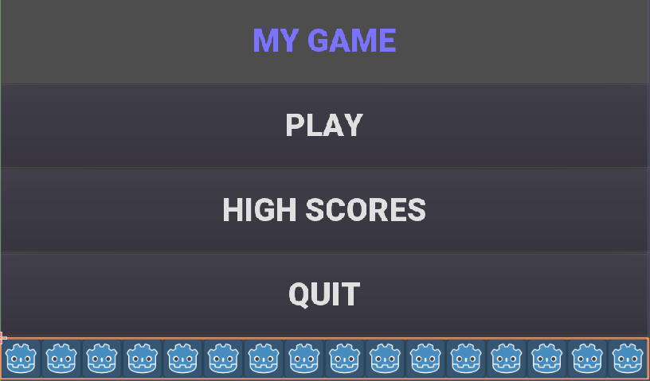
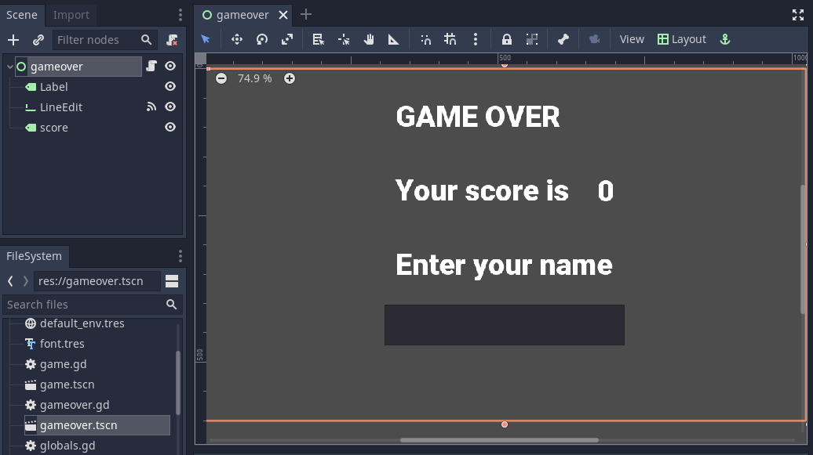
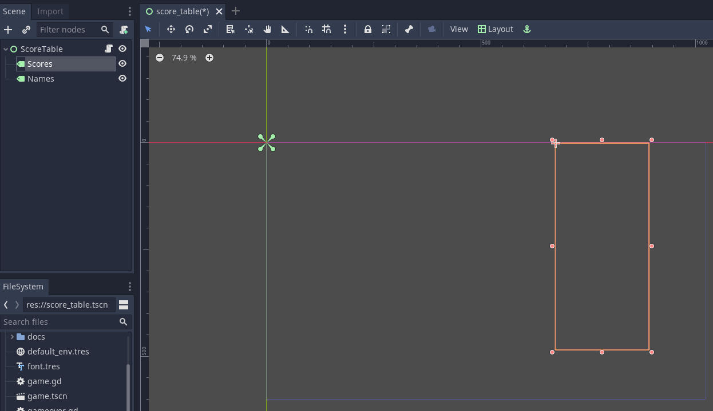

# Godot High Score Tables and Online Leaderboards

This tutorial shows you

* how to add a locally saved high score table to your game.
* how to add an online leaderboard to your game.

If you already have a game you should be able to apply the tutorial to it.  Alternatively, I have provided very simple
game which you can download, import into Godot and use.

[See finished project online](https://electronstudio.github.io/godot_high_scores_tutorial)

[Download simple starter project](godot_high_scores_starter_version.zip)

## The simple game

Before we start adding anything we will look at what the simple game already has and how it works.  (This section is for
information; you don't have to do anything until the next section.)

Our game only has 2 scenes:

* title_screen
* game

The player presses a button on the title screen to switch to the game screen.




You can investigate the nodes used
make the TitleScreen on your own.


The code for this is very simple:

```gdscript
func _on_QuitButton_pressed():
	get_tree().quit()

func _on_PlayButton_pressed():
	get_tree().change_scene("res://game.tscn")
```

These functions are connected to the buttons via signals.  Note there is no function for the high score button yet.

The game scene has only 4 nodes:

* A label to display the time
* A label to display the score
* A timer
* An icon (sprite)


The code simple counts down the timer every second, and increases the score every time a key is pressed:

```gdscript
var time = 10
var score = 0

func _on_Timer_timeout():
	time -= 1
	$TimeLabel.text = "TIME: "+str(time)
	if time <=0:
		get_tree().change_scene("res://title_screen.tscn")

func _unhandled_input(event):
	if event is InputEventKey and not event.echo:
		score += 1
		$ScoreLabel.text = "SCORE: "+str(score)
		$icon.position.y = score * 5

```


## Game Over Screen

We need somewhere for the player to enter his name, so let's make a 'Game Over' screen that will be displayed when the game ends.

1. Create a new scene. 
   
2. Select `User Interface` for  the root node (or `2D Scene`, it doesn't make much difference for this.)  

3. Rename the root node to `gameover`.

4. Save the scene as `gameover.tscn`.

5. Add a `Label` child node to the root node.
    * In the Inspector, enter the text `GAMEOVER Your score is`.
    * In the Inspector, click `Custom Fonts` and then drag the `font.tres` file from the FileSystem (bottom left of screen) into the `[empty]`
    font field.
      
6. Add a second `Label` child node to the root node.
    * Rename it to `score`.
    * In the Inspector, click `Custom Fonts` and then drag the `font.tres` file from the FileSystem (bottom left of screen) into the `[empty]`
      font field.
      
7. Add a `LineEdit` child node to the root node.

8. Drag things around until it looks something like this: 



9. Edit the script file `game.gd` and change `"res://title_screen.tscn"` to `"res://gameover.tscn"` so that the game goes to the gameover
screen at the end.

## Global variables

We have a problem: we want to display the score on the Game Over screen, but the score is only stored in the `game.gd` script, not
the `gameover.gd` one.

In Python (and Godot) we saw global variables that can be used from any function in one script.  

In Python if we want to use a variable from another script we have to import it.  

In Godot we can do something similar but it's easier to create variables that can be used by *any* script in *any* scene by creating a 'singleton object'.  Let's do this.

1. Create a new script (`File` menu, `New Script`) and name it `globals.gd`.

2. Add a score variable to the bottom of the script:

```gdscript
var score=0
```

3. To make this accessible from anywhere:

 * click `Project` menu, then `Project Settings`, then `AutoLoad`.
 * Click the small folder icon and select the `globals.gd` script.  Press `open`.
 * Press `Add`.

4. Now go back the `game.gd` script and delete line 4 containing the score variable.  Then change all the other references that say `score` to `Globals.score`.

The end result will look like this:

```gdscript
extends Node2D

var time = 10

func _on_Timer_timeout():
   time -= 1
   $TimeLabel.text = "TIME: "+str(time)
   if time <=0:
      get_tree().change_scene("res://gameover.tscn")

func _unhandled_input(event):
   if event is InputEventKey and not event.echo:
      Globals.score += 1
      $ScoreLabel.text = "SCORE: "+str(Globals.score)
   $icon.position.y = Globals.score * 5
```

You don't need to type all that, you only need to make 4 edits.  That's the complete file you should have after your changes.

5. Let's see if we can access the score from the gameover screen now.  Go to the `gameover.tscn` scene.  Right click on the root node and
`attach script`.  Edit the script so the ready function looks like this:

```gdscript
func _ready():
	$score.text = str(Globals.score)
```

6. Now run the game and test your score is displayed.

### Question

Why did we have to use the `str()` function here?  What happens if you do  `$score.text = Globals.score` instead?

## Storing the names

Before we can display the table we need somewhere to store the scores and the names, so lets add two lists to `globals.gd` script:

```gdscript
var scores = []
var names = []
```

Go back to `gameover.tscn` scene and click on the `LineEdit` node.  This is where the name is entered.

Click on `Node` to the right of the `Inspector` to view the `Signals`.  Double click on `text_entered`.  Press `connect`.

A function will be created for you that is called when the player enters his name and presses return.  Edit the function to look like this:

```gdscript
func _on_LineEdit_text_entered(new_text):
   Globals.scores.append(Globals.score)
   Globals.names.append(new_text)
   get_tree().change_scene("res://score_table.tscn")
```

## Displaying the high score table

1. Create a new scene.

2. Select `User Interface` for  the root node (or `2D Scene`, it doesn't make much difference for this.)

3. Rename the root node to `ScoreTable`.

4. Save the scene as `score_table.tscn`.

5. Add a `Label` child node to the root node.
   * Rename it to `Names`
   * In the Inspector, click `Custom Fonts` and then drag the `font.tres` file from the FileSystem (bottom left of screen) into the `[empty]`
     font field.

5. Add a `Label` child node to the root node.
    * Rename it to `Scores`
    * In the Inspector, click `Custom Fonts` and then drag the `font.tres` file from the FileSystem (bottom left of screen) into the `[empty]`
      font field.
      
Position the two labels side by side like this:




Right click on the root node and `Attach script`.  Press `create`.  Edit the ready function so it looks like this:

```gdscript
func _ready():
	for name in Globals.names:
		$Names.text += name + "\n"
	for score in Globals.scores:
		$Scores.text += str(score)+"\n"
```

Now if you run the game you should be able to enter your score and see the score table.  However, you will then be stuck because there is no menu
navigation.

## Menu navigation

1. Open the `score_table.tcns` scene.

2. Add a `Button` child node to the root node.
  * Rename it to `BackButton`
    In the Inspector set the `Text` to `Back`.
  * In the Inspector, click `Custom Fonts` and then drag the `font.tres` file from the FileSystem (bottom left of screen) into the `[empty]`
    font field. 

3. Click on `Node` to the right of the `Inspector` to view the `Signals`.  Double click on `pressed`.  Press `connect`.

4. Edit the function so it looks like this:

```gdscript
func _on_BackButton_pressed():
   get_tree().change_scene("res://title_screen.tscn")
```

5. Now go to the `title_screen.tscn` scene.

6. Click on the `HighScoresButton` node.  Click on `Node` to the right of the `Inspector` to view the `Signals`.
Double click on `pressed`.  Press `connect`.

7. Edit the function so it looks like this:

```gdscript
func _on_HighScoresButton_pressed():
	get_tree().change_scene("res://score_table.tscn")
```

8. Well done!  You now have a (sort of) working high score table!  Try it out.

## Saving files

There a couple of big problems with this score table.  The first one is that it loses the scores every time you quit game.

1. To fix this, we can store the scores in a file on the computer's disk.  We will create separate functions for loading and saving
the scores.  Edit `globals.gd` and add this code to the bottom:

```gdscript
func _init():
   load_scores()

func save_scores():
	var file = File.new()
	file.open("user://game.dat", File.WRITE)
	file.store_var(names)
	file.store_var(scores)
	file.close()
	
func load_scores():
	var file = File.new()
	var err = file.open("user://game.dat", File.READ)
	if err != OK:
		print("error loading scores")
	else:
		names = file.get_var()
		scores = file.get_var()
	file.close()
```

2. The first time we run the game there will be no score file, so we will we print an error, but this is OK, because
it will be created when we save the scores.  To do this, edit `gameover.gd` and insert a new line so your function looks like
this:

```gdscript
func _on_LineEdit_text_entered(new_text):
	Globals.scores.append(Globals.score)
	Globals.names.append(new_text)
	Globals.save_scores()
	get_tree().change_scene("res://score_table.tscn")
```

3. Run the game and check your scores load and save.

## Challenge: Default scores

The first time you play the game, the score table is empty.  Could you add some default scores in the code
to fill it?

## Challenge:  Improve the organisation of the code.

Change the above function to be:

```gdscript
func _on_LineEdit_text_entered(name):
	Globals.add_score(name)
	get_tree().change_scene("res://score_table.tscn")
```

Then write the `add_score` function in `globals.gd` to make this work.

## Sorting the scores

Currently, the scores are not displayed in the correct order.  We need to sort them.

Godot has a built-in sort function, so we could call `scores.sort()`, but this would only sort the scores and not the names.
The way a professional coder would deal with this would probably be to store the name and score in an object and write a comparator function.
However, it's more educational (and simpler) for us to just write our own sort function.

This is a famous algorithm called Bubble Sort.  You can read about it here: https://en.wikipedia.org/wiki/Bubble_sort

Add this to the bottom of `globals.gd`:

```gdscript
func bubble_sort():
	for passnum in range(len(scores)-1,0,-1):
		for i in range(passnum):
			if scores[i]<scores[i+1]:
				var temp = scores[i]
				scores[i] = scores[i+1]
				scores[i+1] = temp
				temp = names[i]
				names[i] = names[i+1]
				names[i+1] = temp
```

Call it from an appropriate place, e.g. you could edit `save_scores` function so it sorts every time it saves:

```gdscript
func save_scores():
	bubble_sort()
	var file = File.new()
	file.open("user://game.dat", File.WRITE)
	file.store_var(names)
	file.store_var(scores)
	file.close()
```


## Challenge: Sorting

This bubble sort is not optimized.  Make it `return` as soon as it completes a pass with no swaps.

Implement some better sorting algorithms, such as [Merge Sort](https://en.wikipedia.org/wiki/Merge_sort)
and [Insertion Sort](https://en.wikipedia.org/wiki/Insertion_sort)

## More things to try

Add an 'OK' button on the gameover screen.

Display ranking number 1, 2, 3, etc next to the names.

What do you do when there are too many scores to fit on the screen?  Delete the lowest ones?  Or provide buttons to scroll up and down?