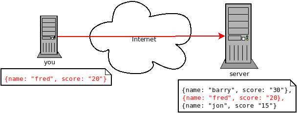
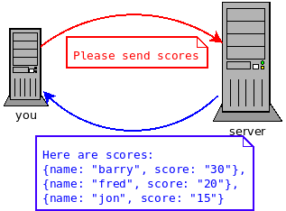
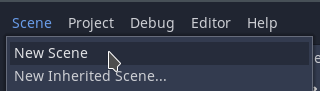
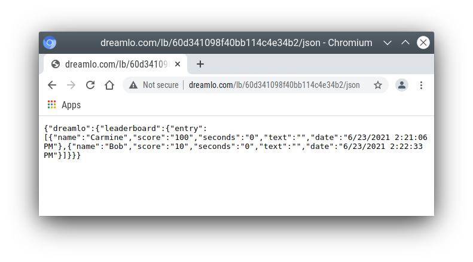

High Score Tables
=================

This tutorial will show you how to add a locally saved high score table
to your game. (The next tutorial will show you how to add an online
leaderboard to your game.)

.. sidebar::
   If you already have a game you should be able to apply the tutorial to
   it. Alternatively, I have provided a very simple game which you can
   download, import into Godot and use.

   Links:

   -  `View finished
      project <https://electronstudio.github.io/godot_high_scores_tutorial>`__
   -  `Download starter
      project <https://electronstudio.github.io/godot_high_scores_tutorial/godot_high_scores_starter_version.zip>`__

The simple game
---------------

Before we start adding anything we will look at what the simple game already has and how it works.

.. note::
   This section is for information; you
   don’t have to do anything until the next section.

Our game only has 2 scenes:

-  *title_screen.tscn*

-  *game.tscn*

.. figure:: titlescreen.png
   :width: 50%

   The player presses a button on the title screen to switch to the game
   screen.

   You can investigate the nodes used make the TitleScreen on your own.

The code for this is very simple:

.. code-block:: gdscript

   func _on_QuitButton_pressed():
       get_tree().quit()

   func _on_PlayButton_pressed():
       get_tree().change_scene("res://game.tscn")

These functions are connected to the buttons via signals. Note there is
no function for the high score button yet.

The game scene has only 4 nodes:

-  A label to display the time
-  A label to display the score
-  A timer
-  An icon (sprite)

   game scene nodes

The code simply counts down the timer every second, and increases the
score every time a key is pressed:

.. code:: gdscript

   var time = 10
   var score = 0

   func _on_Timer_timeout():
       time -= 1
       $TimeLabel.text = "TIME: "+str(time)
       if time <=0:
           get_tree().change_scene("res://title_screen.tscn")

   func _unhandled_input(event):
       if event is InputEventKey and not event.echo:
           score += 1
           $ScoreLabel.text = "SCORE: "+str(score)
           $icon.position.y = score * 5

.. figure:: gamescreen.png
   :alt: The game screen

   The game screen

Game Over Screen
----------------

We need somewhere for the player to enter his name, so let’s make a
‘Game Over’ screen that will be displayed when the game ends.

1. Create a new scene. |newscene|

2. Select *User Interface* for the root node.

   Select User Interface for root node

3. Right click the root node **Control** and rename it to ``gameover``.

4. Press ctrl+S keys and save the scene as ``gameover.tscn``.

5. Add a **Label** child node to the root node.

   -  In the Inspector, click *Custom Fonts* and then drag the
      **font.tres** file from the FileSystem (bottom left of screen)
      into the **[empty]** font field.
   -  In the Inspector, enter into the *Text* field

.. code:: none

   GAMEOVER

   Your score is

6. Add a second **Label** child node to the root node.

   -  Rename it to ``score``.
   -  In the Inspector, enter into the *Text* field: **0**.
   -  In the Inspector, click *Custom Fonts* and then drag the
      **font.tres** file from the FileSystem (bottom left of screen)
      into the **[empty]** font field.

7. Add a **LineEdit** child node to the root node.

   -  In the Inspector, click *Custom Fonts* and then drag the
      **font.tres** file from the FileSystem (bottom left of screen)
      into the **[empty]** font field.

8. Drag things around until it looks something like this:

.. figure:: gameover.png
   :alt: Gameover scene

   Gameover scene

9. Edit the script file **game.gd**.

   -  Change ``"res://title_screen.tscn"`` to ``"res://gameover.tscn"``
      so that the game goes to the gameover screen at the end.

Global variables
----------------

We have a problem: we want to display the score on the Game Over screen,
but the score is only stored in the **game.gd** script, not the
**gameover.gd** one.

In Python (and Godot) we saw *global* variables that can be used from
any function in one script. In Python if we want to use a variable from
another script we have to import it.

In Godot we can do something similar but it’s easier to create variables
that can be used by *any* script in *any* scene by creating a *singleton
object*. Let’s do this.

1. Create a new script. It won’t be attached to a node, so we have to go
   to the script editor and click *File* menu, then **New Script**.
   Enter ``globals.gd`` as the name of the script and press **create**.

2. Add a score variable to the bottom of the script:

.. code:: gdscript

   var score=0

3. Save the script. (ctrl-S)

4. To make this accessible from anywhere:

   -  Click *Project* menu, then *Project Settings*, then *AutoLoad*.
   -  Click the small folder icon and select the *globals.gd* script.
      Press *open*.
   -  Press *Add*. Then *Close*.

5. Now go back the *game.gd* script and delete the line containing the
   score variable (line 5). Then change all the other references from
   ``score`` to ``Globals.score``.

   The end result should look like this:

.. code:: gdscript

   extends Node2D

   var time = 10

   func _on_Timer_timeout():
      time -= 1
      $TimeLabel.text = "TIME: "+str(time)
      if time <=0:
         get_tree().change_scene("res://gameover.tscn")

   func _unhandled_input(event):
      if event is InputEventKey and not event.echo:
         Globals.score += 1
         $ScoreLabel.text = "SCORE: "+str(Globals.score)
         $icon.position.y = Globals.score * 5

You don’t need to type all that, you only need to make 4 edits. But
that’s the complete file you should have after your changes.

6. Let’s see if we can access the score from the gameover screen now. Go
   to the **gameover.tscn** scene. Right click on the root node and
   **attach script**. Press **create**. Edit ready function (delete the
   ``pass``) so that it looks like this:

.. code:: gdscript

   func _ready():
       $score.text = str(Globals.score)

7. Now run the game and test that your score is indeed displayed.

..

   Why did we have to use the ``str()`` function here? What happens if
   you do ``$score.text = Globals.score`` instead?

Storing the names
-----------------

Before we can display the table we need somewhere to store the scores
and the names, so let’s add two lists to the end of the **globals.gd**
script:

.. code:: gdscript

   var scores = []
   var names = []

Go back to **gameover.tscn** scene and click on the **LineEdit** node.
This is where the name is entered.

Click on *Node* to the right of the *Inspector* to view the *Signals*.
Double click on **text_entered**. Press **connect**.

A function will be created for you that is called when the player enters
his name and presses return. Edit the function to look like this:

.. code:: gdscript

   func _on_LineEdit_text_entered(new_text):
      Globals.scores.append(Globals.score)
      Globals.names.append(new_text)
      get_tree().change_scene("res://score_table.tscn")

Displaying the high score table
-------------------------------

1. Create a new scene.

2. Select **User Interface** for the root node.

3. Rename the root node to ``ScoreTable``.

4. Save the scene as ``score_table.tscn``.

5. Add a **Label** child node to the root node.

   -  Rename it to ``Names``
   -  In the Inspector, click *Custom Fonts* and then drag the
      **font.tres** file from the FileSystem (bottom left of screen)
      into the **[empty]** font field.

6. Add a **Label** child node to the root node.

   -  Rename it to ``Scores``
   -  In the Inspector, click *Custom Fonts* and then drag the
      **font.tres** file from the FileSystem (bottom left of screen)
      into the **[empty]** font field.

7. Position the two labels side by side like this:

   |image1| |image2|

8. Right click on the root node and *Attach script*. Press *create*.
   Edit the *ready* function so that it looks like this:

.. code:: gdscript

   func _ready():
       for name in Globals.names:
           $Names.text += name + "\n"
       for score in Globals.scores:
           $Scores.text += str(score)+"\n"

9. Run the game and test.

You should be able to enter your score and see the score table. However,
you will then be stuck because there is no menu navigation.

Menu navigation
---------------

1. Open the **score_table.tcns** scene.

2. Add a **Button** child node to the root node.

-  Rename it to ``BackButton`` In the Inspector set the **Text** to
   ``Back``.

-  In the Inspector, click *Custom Fonts* and then drag the
   **font.tres** file from the FileSystem (bottom left of screen) into
   the **[empty]** font field.

   |image3|

3. Click on *Node* to the right of the *Inspector* to view the
   *Signals*. Double click on **pressed**. Press **connect**.

4. Edit the function so that it looks like this:

.. code:: gdscript

   func _on_BackButton_pressed():
      get_tree().change_scene("res://title_screen.tscn")

5. Now go to the **title_screen.tscn** scene.

6. Click on the **HighScoresButton** node. Click on *Node* to the right
   of the *Inspector* to view the *Signals*. Double click on
   **pressed**. Press **connect**.

7. Edit the function so that it looks like this:

.. code:: gdscript

   func _on_HighScoresButton_pressed():
       get_tree().change_scene("res://score_table.tscn")

8. Well done! You now have a (sort of) working high score table! Try it
   out.

.. sidebar:: Challenge: fix the bug

   We have accidentally introduced a bug into the game that happens when
   you play two or more games in a row without quitting. What is the bug?

   How can you fix it?

Saving files
------------

There a couple of big problems with this score table. The first one is
that it loses the scores every time you quit game.

To fix this, we can store the scores in a file on the computer’s disk.
We will create separate functions for loading and saving the scores.
Edit **globals.gd** and add this code to the bottom:

.. code-block:: gdscript

   func _init():
      load_scores()

   func save_scores():
       var file = File.new()
       file.open("user://game.dat", File.WRITE)
       file.store_var(names)
       file.store_var(scores)
       file.close()
       
   func load_scores():
       var file = File.new()
       var err = file.open("user://game.dat", File.READ)
       if err != OK:
           print("error loading scores")
       else:
           names = file.get_var()
           scores = file.get_var()
       file.close()

The first time we run the game there will be no score file, so we will
we print an error, but this is OK, because it will be created when we
save the scores. To do this, edit **gameover.gd**, and insert the one
new line highlighted below:

.. code-block:: gdscript
   :emphasize-lines: 4

   func _on_LineEdit_text_entered(new_text):
       Globals.scores.append(Globals.score)
       Globals.names.append(new_text)
       Globals.save_scores()
       get_tree().change_scene("res://score_table.tscn")

Run the game and check your scores load and save.

.. sidebar:: Challenge: Default scores

   The first time you play the game, the score table is empty. Could you
   add some default scores in the code to fill it?

.. sidebar:: Advanced Challenge: Improve the organisation of the code.

   Change the above function to be:

   .. code:: gdscript

      func _on_LineEdit_text_entered(new_text):
          Globals.add_score(new_text)
          get_tree().change_scene("res://score_table.tscn")

   Then write the ``add_score`` function in ``globals.gd`` to make this
   work.

   .. warning::

      If you attempt this challenge but do not complete it, remember to undo the
      changes you made to the *on_LineEdit_text_entered* function.

Sorting the scores
------------------

Currently, the scores are not displayed in the correct order. We need to
sort them.

Godot has a built-in sort function, so we could call ``scores.sort()``,
but this would only sort the scores and not the names. The way a
professional coder would deal with this would probably be to store the
name and score in an object and write a comparator function. However,
it’s more educational (and simpler) for us to just write our own sort
function. (Not to mention that Godot’s support for object-oriented
programming is frustratingly rudimentary!)

This is a famous algorithm called `Bubble
Sort <https://en.wikipedia.org/wiki/Bubble_sort>`__.

Add this to the bottom of **globals.gd**:

.. code:: gdscript

   func bubble_sort():
       for passnum in range(len(scores)-1,0,-1):
           for i in range(passnum):
               if scores[i]<scores[i+1]:
                   var temp = scores[i]
                   scores[i] = scores[i+1]
                   scores[i+1] = temp
                   temp = names[i]
                   names[i] = names[i+1]
                   names[i+1] = temp

Edit the **save_scores** function so that it sorts every time it saves
(new line highlighted)

.. code-block::
   :emphasize-lines: 2

   func save_scores():
       bubble_sort()
       var file = File.new()
       file.open("user://game.dat", File.WRITE)
       file.store_var(names)
       file.store_var(scores)
       file.close()

.. sidebar:: Challenge

   This bubble sort is not optimized. Make it ``return`` as soon as it
   completes a pass with no swaps.

.. sidebar:: Advanced Challenge

   Implement some better sorting algorithms, such as `Merge
   Sort <https://en.wikipedia.org/wiki/Merge_sort>`__ and `Insertion
   Sort <https://en.wikipedia.org/wiki/Insertion_sort>`__

More things to try
------------------

Add an ‘OK’ button on the gameover screen.

Display ranking number 1, 2, 3, etc next to the names.

What do you do when there are too many scores to fit on the screen?
Delete the lowest ones? Or provide buttons to scroll up and down?

Online leaderboards
===================

Saving to a local file is very useful, but if you want to compare your
scores with your friends? You can’t read files saved to your friends’
computers, so instead you need to store all the scores on a computer on
the Internet. This is called a *server*. Then as well as saving your
score locally, you also send it to the server, like this:

   Sending the high score

The server saves your score along with all the scores of everybody else.
Then when you want to display the scores, you send a request to the
server to retrieve them:

   Requesting the high scores

Usually I would not suggest relying on third party servers for your
game.

.. sidebar::

   If you use a third party leaderboard service, what will the effect on
   your game be if it is not running? Do you think it will still be
   running five years from now?

However the *dreamlo* server is very simple, so if it does stop running
it will not be difficult for us to create our own replacement. (That
would would be the topic for another tutorial. For now we will use
*dreamlo*).

Dreamlo sign-up
---------------

In your web browser, go to the website
`dreamlo.com <http://dreamlo.com/>`__.

.. figure:: dreamlo1.png
   :alt: dreamlo website
   :width: 70.0%

   dreamlo website

Click **Get Yours Now** button.

   You will be given a private URL. Copy and paste it into a document,
   or add it to your bookmarks. You must not lose it and you must not
   give it to anyone else.

In Godot, open **globals.gd**. Add these two variables, but **rather
than using my values, copy and paste the codes given to you on the left
side of the web page.**

.. code:: gdscript

   var public_code = "60d206118f40bb114c4ca743"
   var private_code = "iRJrbvqSmkykd5aQBcXlAgm6EWSo3SekmWhWF5W-zfkA"

Submitting scores manually
--------------------------

Copy this URL into a new web browser window and press enter, but replace
the code with your *private* code. (You can see this example on your
private dreamlo page with the correct code already filled in)

.. code:: none

   http://dreamlo.com/lb/Sv3NeBzS0016IwMfZjGudTESQhkHwEpQ/add/Carmine/100

|image4|

You should get a response that says *OK* or similar. You have submitted
the score of 100 for player Carmine. Go ahead and submit a few more
scores for other players.

To test if it worked, copy this URL and press enter but replace the code
with your *private* code. (You can see this example on the dreamlo page
with the correct code already filled in.)

::

   http://dreamlo.com/lb/60d341098f40bb114c4e34b2/json

You will get a response that looks something like this:

|image5|

Here it is with nicer indentation:

.. code:: json

   {"dreamlo":
     {"leaderboard":
       {"entry":
         [
           {"name":"Carmine","score":"100","seconds":"0"},
           {"name":"Bob","score":"10","seconds":"0"}
         ]
       }
     }
   }

This is just plain text, but it is formatted in a format called *JSON*
which makes it easy for us to write a program that processes. The names
of the objects are important and we will need them later. Also note that
curly brackets mean objects and square brackets mean lists/arrays.

Submitting scores programmatically
----------------------------------

1. Open the **gameover.tscn** scene. Right click on the root node and
   add a child node. Choose **HTTPRequest** as the kind of node.

2. Open **gameover.gd** script and change the
   **on_LineEdit_text_entered** function so it looks like this (3 new
   lines):

.. code-block::
   :emphasize-lines: 5-7

   func _on_LineEdit_text_entered(new_text):
       Globals.scores.append(Globals.score)
       Globals.names.append(new_text)
       Globals.save_scores()
       var url = "http://dreamlo.com/lb/"+Globals.private_code+"/add/"
       url += new_text.percent_encode()+"/"+str(Globals.score)
       $HTTPRequest.request(url)
       get_tree().change_scene("res://score_table.tscn")

3. If you run this, play the game and submit a score, it will appear to
   work. However networking coding is tricksy.

   In your web browser, open the URL that you used previously to get the
   high s core table in JSON format. (For me this is
   *http://dreamlo.com/lb/60d206118b114c4ca743/json* but your public
   code will be different.)

   You will probably find the score was not added. Why not? Because we
   changed the scene without waiting for the network request to finish.
   How long do we have to wait? It depends on the network speed. So we
   will next use a *callback function* that is called for us by Godot
   when the request is completed.

4. **DELETE** this line from the **on_LineEdit_text_entered** function.

.. code:: gdscript

       get_tree().change_scene("res://score_table.tscn")

5. Click on the **HTTPRequest** node. Click *Node* next to *Inspector*
   on the right to view the **Signals**. Double click the
   **request_complated** signal. Press *connect*.

   Edit the function it generates to look like this:

.. code:: gdscript

   func _on_HTTPRequest_request_completed(result, response_code, headers, body):
       get_tree().change_scene("res://score_table.tscn")

6. Play the game, submit a score, and check it is added to dreamlo’s
   JSON data in the web browser.

Downloading the scores programmatically
---------------------------------------

1. Create a new scene.

2. Select **User Interface** for the root node.

3. Rename the root node to ``OnlineScoreTable``.

4. Save the scene as ``online_score_table.tscn``.

5. Add a **Label** child node to the root node.

   -  Rename it to ``Names``
   -  In the Inspector, click **Custom Fonts** and then drag the
      ``font.tres`` file from the FileSystem (bottom left of screen)
      into the ``[empty]`` font field.

6. Add a **Label** child node to the root node.

   -  Rename it to ``Scores``
   -  In the Inspector, click **Custom Fonts** and then drag the
      **font.tres** file from the FileSystem (bottom left of screen)
      into the **[empty]** font field.

7. Position the two labels side by side like this:

|image6| |image7|

7. Right click on the root node and add a child node. Choose
   **HTTPRequest** as the kind of node.

8. Right click on the root node and **Attach script**. Press **create**.
   Edit the ready function so it looks like this:

.. code:: gdscript

   func _ready():
     $HTTPRequest.request("http://dreamlo.com/lb/"+Globals.public_code+"/json")

9. Click on the **HTTPRequest** node. Click *Node* next to *Inspector*
   on the right to view the **Signals**. Double click the
   **request_complated** signal. Press **connect**.

   Edit the function it generates to look like this:

.. code:: gdscript

   func _on_HTTPRequest_request_completed(result, response_code, headers, body):
       var json  = JSON.parse(body.get_string_from_utf8())
       var scores = json.result["dreamlo"]["leaderboard"]["entry"]
       for i in scores:
           $Names.text += i["name"] + '\n'
           $Scores.text += i["score"] + '\n'

Note how we needed the field names from the JSON output in order to tell
Godot how to pull out the data from the text and put it in a list for
us.

10. Go to the **title_screen.tscn** scene.

11. Right click on the **VBoxContainer** node and add a **Button** child
    node.

    -  Rename it to ``OnlineHighScoreButton``.
    -  In the Inspector, enter into the **Text** field: **ONLINE
       SCORES**.
    -  In the Inspector, click **Custom Fonts** and then drag the
       ``font.tres`` file from the FileSystem (bottom left of screen)
       into the ``[empty]`` font field.

12. Click on *Node* to the right of the *Inspector* to view the
    **Signals**. Double click on **pressed**. Press **connect**.

    Edit the function that is created to look like this:

.. code:: gdscript

   func _on_OnlineHighScoresButton_pressed():
       get_tree().change_scene("res://online_score_table.tscn")

13. Run the game and test.

Error handling
--------------

.. NOTE:: When you run this code it may work, but it may also crash.

Why? Because there are several possible responses the server could send
you, and you don’t know which you are going to get.

-  There could be an error on the server or network that prevents
   getting any response at all.

-  You could get a response that does not contain data in the JSON
   format you were expecting.

-  You could get a response that contains no scores, because no-one has
   played the game yet.

-  You could get a response that is just a single score, because only
   one person has played the game.

-  You could get a response that is a list of scores.

Ideally we would write code to handle all of these possibilities, so
that our game doesn’t crash unexpectedly.

For now, we are just going to do three basic error checks and ``return``
if there is an error. Note that we consider there being one single score
to be an error, so **you must submit two or more scores before this will
display anything on the screen**.

Edit the function so that it looks like this:

.. code:: gdscript

   func _on_HTTPRequest_request_completed(result, response_code, headers, body):
       if result != HTTPRequest.RESULT_SUCCESS:
           return
       var json  = JSON.parse(body.get_string_from_utf8())
       if json.error != OK:
           return
       var scores = json.result["dreamlo"]["leaderboard"]["entry"]
       if not scores is Array:
           return
       for i in scores:
           $Names.text += i["name"] + '\n'
           $Scores.text += i["score"] + '\n'

.. sidebar:: Challenges

   * Show the user what is going on. Display **Downloading Scores** when the
     scene loads, and then display **Scores Downloaded** when they have
     downloaded successfully. If one of the errors happens, display what the
     error is.

   *  Handle the case when the table contains only one score. Hint:

      .. code:: gdscript

         if scores is Dictionary:
             $Names.text == scores["name"]

   *  Add additional error checks. For example, what would happen if the JSON
      did not contain an entry for ``leaderboard``?

   *  Dreamlo also allows a time to be submitted along with the score. This is
      useful for games with a timer. Submit times for your game.

.. |image1| image:: tablenames.png
   :width: 50.0%
.. |image2| image:: tablescores.png
   :width: 50.0%

.. |image4| image:: dreamlo3.png
   :width: 75.0%

.. |image6| image:: tablenames.png
   :width: 50.0%
.. |image7| image:: tablescores.png
   :width: 50.0%
